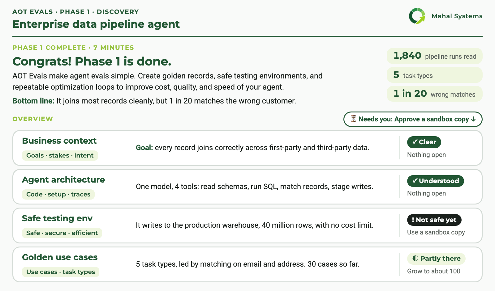

# AOT Evals

Create golden records, safe testing environments, and repeatable optimization loops to improve
cost, quality, and speed of your agent.

<p align="center">
  
</p>

A Claude Code plugin from Mahal Systems, part of **AOT, the Agent Optimization Toolkit**. It works
on **your own agent**, in your own repository. There's no service and no account, and nothing is
installed into your project.

## How to run

You need [Claude Code](https://code.claude.com), `git`, and [uv](https://docs.astral.sh/uv/)
(or Python 3.11+ with PyYAML). Install the plugin:

```bash
claude plugin marketplace add Mahalanobis-Systems/aot-evals
claude plugin install aot-evals@aot-evals
```

Or, inside Claude Code: `/plugin marketplace add Mahalanobis-Systems/aot-evals`, then
`/plugin install aot-evals@aot-evals`. Restart Claude Code afterwards.

Then open Claude Code in your agent's repository and run the one command to remember:

```
/aot-evals:start
```

The first time, it runs Phase 1: it finds your agents, asks which one to test and three
questions about it, and writes a discovery report like the one above in about five minutes.
Run `/aot-evals:start` again for Phase 2: it says where things stand and builds the suite step
by step, stopping for your review at each checkpoint.

**Try it on a toy agent first (about a minute).** In Claude Code, in any empty folder, ask:
*"Run `aot-evals demo` and show me what it made."* It builds a toy calendar agent with a finished
suite, runs a baseline and a candidate that breaks two cases, and compares them. Nothing calls a
model or a network service.

Judges default to a free System One model (Jev, through OpenCode Zen) that needs no key but
allows about 250 calls a day; set `ANTHROPIC_API_KEY` to use Claude as a judge. See
[references/judge-backends.md](references/judge-backends.md). If something doesn't work, ask
Claude to run `aot-evals doctor`.

**Updating.** Releases are listed in [CHANGELOG.md](CHANGELOG.md) and on the
[releases page](https://github.com/Mahalanobis-Systems/aot-evals/releases).

```bash
claude plugin marketplace update aot-evals
claude plugin update aot-evals@aot-evals     # then restart Claude Code
```

Or turn on auto-update for the `aot-evals` marketplace in `/plugin` → Marketplaces.

## Overview

Good evals give you tests that predict how your agent will do in production, and show what to
fix next. They rest on four things, and AOT Evals checks each one for your agent:

| | What it means | What we look at |
|---|---|---|
| **Business context** | Why the agent exists, who relies on it, and what it costs when it answers wrong. | Goals · stakes · intent |
| **Agent architecture** | Its code, prompts, models and tools, its production setup, and the traces of real runs. When the setup and the traces disagree, we trust the traces. | Code · setup · traces |
| **Safe testing env** | Runs that can't touch real people, data or money, and are fast and cheap to repeat. | Safe · secure · efficient |
| **Golden use cases** | Examples drawn from real runs, grouped into the handful of task types the agent actually handles. | Use cases · task types |

## How it works

**Phase 1: discovery (about 5 minutes).** AOT Evals scans your repository for agents and asks
which one to test. It asks three questions: why you're testing it now, what the goals around it
are, and what you'll use the tests for. Then four reads run side by side: how the agent works,
its tools and where it could be tested safely, its traffic and the kinds of tasks it handles,
and what data it touches and how private it is. You get a plain-English discovery report: an
overview of the four pillars, the details behind each, and the next steps.

**Phase 2: building the evals (about an afternoon).** It builds a safe place to run the agent,
turns real runs into cleaned test cases grouped by task type, writes the checks (code first, AI
graders only where code can't decide, tuned against your own labels), then runs the suite
several times and reports quality, cost and speed with how sure each number is. It stops only for
things that could touch real people, data or money, and leaves a checkpoint page for your review
at each step.

Under the hood:

- **Three planes, reported separately:** correctness, operational cost, and trust in the
  instruments.
- **Two case sets:** one for finding errors, one for estimating quality.
- **Commands C0–C18, each with an exit gate.** Refusal gates G1–G13 mean a number that can't be
  defended isn't printed.
- **A fixed `report.json` schema**, which Claude renders into a local HTML report written for the
  question being asked.

The method, with every command, measurement and gate, is in [docs/method.md](docs/method.md).

<details>
<summary><b>What ships</b></summary>

| Part | Where |
|---|---|
| Skills: `start` (the entry point: runs Phase 1 or Phase 2, whichever is next), `discover` (Phase 1), `status` (router for Phase 2), `scope` (C0–C4), `build` (C5–C8), `calibrate` (C9–C11), `run` (C12–C17), `report` (C18). Only `start`, `discover` and `status` appear in the `/` menu; Claude loads the step skills when it reaches them | [skills/](skills/) |
| `aot-evals` CLI: the deterministic half (gates, import, allocation, screening, runs, judge labelling, calibration and reliability, operational counters, `report.json`, checkpoints) | [bin/aot-evals](bin/aot-evals), [src/aot_evals/](src/aot_evals/) |
| The suite the plugin keeps in your repository, `evals/agents/<agent>/` | [docs/method.md §3](docs/method.md#3-repository-contract); templates in [src/aot_evals/templates/evals/](src/aot_evals/templates/evals/) |
| Case, code-check and judge templates | [templates/](templates/) |
| Reference material: the eval-creation process, the agent-properties framework, sourced literature findings, the agent contract, judge backends | [references/](references/) |
| A toy agent with a finished suite (`aot-evals demo`) | [examples/calendar/](examples/calendar/) |
| Banner mod: draws the AOT EVALS banner in the terminal when `aot-evals start` runs | [hooks/](hooks/) |
| Brand: the AOT logo, the embedded fonts (SIL OFL 1.1), and the rules every HTML report follows | [brand/](brand/) |

</details>

<details>
<summary><b>The CLI</b></summary>

The skills drive the CLI for you, but you can run it directly in a Claude Code session. With
several agents in one repository, pass `--agent NAME` to every command.

```bash
aot-evals demo [DIR]                             # a toy agent with a finished suite
aot-evals doctor                                 # check the environment
aot-evals --agent NAME init                      # create evals/agents/NAME/
aot-evals status                                 # gates C0–C18, and what's next
aot-evals import traces.jsonl --source ... --query ... --window ...   # C0
aot-evals ops --export <id> --field cost_usd=... # E14: operational costs in week one
aot-evals run --purpose smoke --question "..."   # C1: the agent runs end to end
aot-evals allocate --write                       # C5
aot-evals screen; aot-evals screen --read-by NAME --case ID           # C7
aot-evals run --purpose baseline --k 5           # C12 (judges run with their primary backend)
aot-evals run ... --pause-every 20 --pause-seconds 900   # pace a rate-limited runtime
aot-evals label queue --judge J --open; aot-evals label import --judge J --csv ...  # C9, on a page
aot-evals calibrate --judge J                    # C10 / E3 / E5
aot-evals reliability --judge J --backend A --backend B   # C11 / E4
aot-evals run --purpose candidate --k 5 --variable model=...    # a second version
aot-evals compare; aot-evals coverage; aot-evals redundancy     # C13, C14, C15
aot-evals report                                 # C18 → <suite>/report/report.json
aot-evals activity --open                        # the live activity log (every command logs itself)
aot-evals log "..." [--kind finding|decision|question] --gate C3     # add to it
aot-evals checkpoint --gate C3 --ask "..." --open   # a checkpoint page for the owner
```

Drift monitoring (C16) and online evaluation (C17) are described in the method but not yet
automated.

</details>

## Telemetry

AOT Evals sends pseudonymous usage telemetry so we can see how many teams use it and how far they
get: a random local install id, the milestone reached (Phase 1 started, discovery report written,
a checkpoint at a gate, a report built), the gate id, the version, your OS name and a timestamp.
It **never** sends your code, agent, repository, cases, answers, file paths or IP address. A
notice is shown before the first event, and it's off whenever Claude Code's own telemetry is off,
on Bedrock, Google Cloud and Foundry, and in CI. See exactly what would be sent:

```bash
aot-evals telemetry show
```

Turn it off with `aot-evals telemetry off`, `AOT_EVALS_TELEMETRY=0` or `DO_NOT_TRACK=1`. Details,
retention and how to have your data deleted: [SECURITY.md](SECURITY.md#telemetry).

Separately, AI graders send the case and the agent's answer to the judge backend you use, by
default the free System One model on OpenCode Zen. Your code, traces, cases and reports stay in
your repository.

## Contributing

Feedback, bug reports and pull requests are welcome: see [CONTRIBUTING.md](CONTRIBUTING.md). To
report a security problem, see [SECURITY.md](SECURITY.md).

Releases follow [Semantic Versioning](https://semver.org/). Every user-visible change is noted
under `## Unreleased` in [CHANGELOG.md](CHANGELOG.md). To release, a maintainer runs
`python3 scripts/release.py X.Y.Z`, which sets the version everywhere it lives and moves the
changelog notes under the new version, then merges that as a pull request. On merge, a GitHub
Action tags the commit `aot-evals--vX.Y.Z` and publishes a GitHub release. The marketplace
installs the plugin from that tag, so users only ever get released code. The full process is in
[CONTRIBUTING.md](CONTRIBUTING.md#releasing).

```bash
uv run --no-project --python 3.11 --with pyyaml --with pytest env PYTHONPATH=src python -m pytest -q
uvx ruff check src tests scripts
claude --plugin-dir .          # run Claude Code with your working copy of the plugin
AOT_EVALS_LIVE=1 uv run --no-project --python 3.11 --with pyyaml --with pytest env PYTHONPATH=src \
  python -m pytest -q tests/test_live_systemone.py   # opt-in: six free calls to Jev on OpenCode Zen
```

## The agent contract

Your agent runs as a command; framework, language and model provider don't matter. Each test
case arrives as one JSON object on stdin, and the agent prints one JSON object to stdout: its
answer, plus optional usage (tokens, cost, tool calls), the model ids it used, a trace id and an
outcome code. Two optional hooks let checks grade what the agent actually changed: `seed` puts
the world into the case's start state before each attempt, and `observe` prints the world's
state before and after. The full contract is in
[references/agent-contract.md](references/agent-contract.md).

## License

[Apache License 2.0](LICENSE). The bundled fonts are under the SIL Open Font License 1.1, and the
Mahal Systems and AOT names and logo are trademarks; see [NOTICE](NOTICE).
